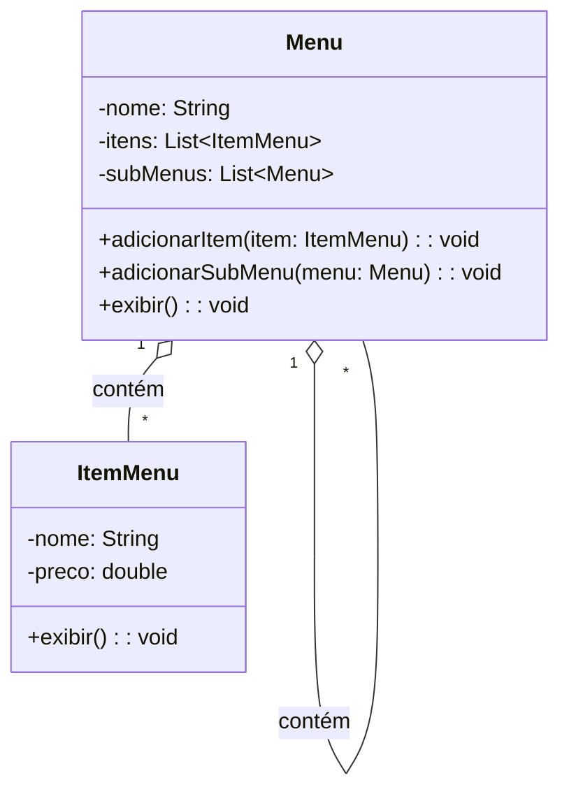
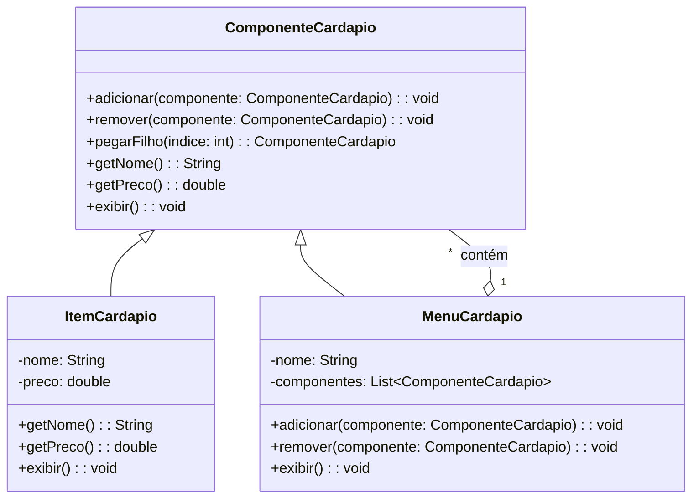

# Composite

## Intenção
Compor objetos em estruturas de árvore para representar hierarquias partes-todo. O padrão Composite permite que clientes tratem objetos individuais e composições de objetos de maneira uniforme.

## Também conhecido como
Parte-todo (Part-Whole)

## Motivação
Imagine que você está desenvolvendo o sistema de um restaurante, e o cliente pediu um cardápio digital para exibir aos clientes.

### Situação inicial:
No início, o cardápio é simples, contendo apenas itens individuais, como "Hambúrguer", "Refrigerante", "Sorvete".  
A estrutura era direta: uma lista simples de itens.

Porém, com o tempo, o restaurante começou a crescer, e o dono pediu:
- Categorias no cardápio, como Lanches, Bebidas, Entradas e Sobremesas.
- Subcategorias, como Sucos Naturais dentro de Bebidas.
  
Agora é necessário criar essa uma estrutura hierárquica, com menus dentro de menus, além dos itens individuais.  
O código sem Composite começou a ficar complicado, pois o cliente (código que usa o cardápio) precisava saber se estava lidando com um item ou um menu, além de ter que selecionar cada item manualmente, dessa forma, era mais ágil criar combos com preços mais atrativos e agilizar o processo de pedido pelo cliente

### Exemplo da hierarquia desejada:
```
Menu Principal
├── Lanches
│   ├── Hambúrguer - R$ 15.00
│   ├── VegBurguer (Hambúrguer Vegetariano) - R$ 20.00
│   ├── Cheeseburger - R$ 17.00
│   ├── Hot Dog - R$ 12.00
│   ├── Combo 3 em 1 (Hambúrger, Refrigerante, Batata Fritas) - R$ 32.00
│   ├── Combo Casal (2 Hambúrger, 2 Refrigerantes, 2 Batatas Fritas, 2 Sorvetes) - R$ 80,00
│   ├── Combo Fit (VegBurger, Suco Natural) - R$ 25.00
│   ├── Combo Dogão (Hot Dog, Refrigerante, Nachos) - R$ 32.00
│   ├── Combo Sobremesas (Bolo Chocolate, Pudim, Suco Natural) - R$ 22.00
├── Bebidas
│   ├── Refrigerante - R$ 5.00
│   ├── Suco Natural - R$ 7.00
├── Entradas
│   ├── Batata Frita - R$ 15.00
│   ├── Onion Rings - R$ 9.00
│   ├── Nachos - R$ 11.00
└── Sobremesas
    ├── Sorvete - R$ 8.00
    ├── Bolo de Chocolate - R$ 10.00
    ├── Pudim - R$ 6.00
    ├── Torta de Limão - R$ 9.00
```

## Solução com Composite:
O padrão Composite resolve o problema ao permitir que menus compostos e itens simples sejam tratados da mesma maneira.  
Assim:
- Podemos adicionar menus e submenus recursivamente.
- O cliente não precisa se preocupar em diferenciar itens de menus.
- A manipulação da estrutura do cardápio fica simples, flexível e extensível.
- Possibilidade de Criação de Combos, dando maior flexibilidade

## Estrutura

### Antes do Composite


### Depois com Composite


## Implementação:

### Código com Composite
```java
package ComComposite;

public class RestauranteComComposite {

    public static void main(String[] args) {

        MenuComponent menuPrincipal = new Menu("Menu Principal");

        MenuComponent lanches = new Menu("Lanches");
        lanches.add(new MenuItem("Hambúrguer", 15.00));
        lanches.add(new MenuItem("Cheeseburger", 17.00));
        lanches.add(new MenuItem("Hot Dog", 12.00));
        menuPrincipal.add(lanches);

        MenuComponent bebidas = new Menu("Bebidas");
        bebidas.add(new MenuItem("Refrigerante", 5.00));
        bebidas.add(new MenuItem("Suco Natural", 7.00));
        menuPrincipal.add(bebidas);

        MenuComponent fritos = new Menu("Fritos");
        fritos.add(new MenuItem("Batata Frita", 15.00));
        fritos.add(new MenuItem("Onion Rings", 9.00));
        fritos.add(new MenuItem("Nachos", 11.00));
        menuPrincipal.add(fritos);

        MenuComponent sobremesas = new Menu("Sobremesas");
        sobremesas.add(new MenuItem("Sorvete", 8.00));
        sobremesas.add(new MenuItem("Bolo de Chocolate", 10.00));
        sobremesas.add(new MenuItem("Pudim", 6.00));
        sobremesas.add(new MenuItem("Torta de Limão", 9.00));
        menuPrincipal.add(sobremesas);

        MenuComponent combo3Em1 = new Combo("Combo 3 em 1");
        combo3Em1.add(new MenuItem("Hambúrguer", 15.00));
        combo3Em1.add(new MenuItem("Refrigerante", 5.00));
        combo3Em1.add(new MenuItem("Batata Frita", 15.00));
        menuPrincipal.add(combo3Em1);

        MenuComponent comboCasal = new Combo("Combo Casal");
        comboCasal.add(new MenuItem("Hambúrguer", 15.00));
        comboCasal.add(new MenuItem("Hambúrguer", 15.00));
        comboCasal.add(new MenuItem("Refrigerante", 5.00));
        comboCasal.add(new MenuItem("Refrigerante", 5.00));
        comboCasal.add(new MenuItem("Batata Frita", 15.00));
        comboCasal.add(new MenuItem("Batata Frita", 15.00));
        comboCasal.add(new MenuItem("Sorvete", 8.00));
        comboCasal.add(new MenuItem("Sorvete", 8.00));
        menuPrincipal.add(comboCasal);

        MenuComponent comboFit = new Combo("Combo Fit");
        comboFit.add(new MenuItem("VegBurger", 20.00));
        comboFit.add(new MenuItem("Suco Natural", 7.00));
        menuPrincipal.add(comboFit);

        MenuComponent comboDogao = new Combo("Combo Dogão");
        comboDogao.add(new MenuItem("Hot Dog", 12.00));
        comboDogao.add(new MenuItem("Refrigerante", 5.00));
        comboDogao.add(new MenuItem("Nachos", 11.00));
        menuPrincipal.add(comboDogao);

        MenuComponent comboSobremesas = new Combo("Combo Sobremesas");
        comboSobremesas.add(new MenuItem("Bolo de Chocolate", 10.00));
        comboSobremesas.add(new MenuItem("Pudim", 6.00));
        comboSobremesas.add(new MenuItem("Suco Natural", 7.00));
        menuPrincipal.add(comboSobremesas);

        System.out.println("\n---------- CARDÁPIO COMPLETO ----------\n");
        menuPrincipal.display();
    }
}

```

## Conclusão
O padrão Composite é essencial para estruturas hierárquicas, permitindo que objetos simples e compostos sejam tratados uniformemente.  
No cenário do restaurante, ele facilitou a gestão de menus e itens, tornando o sistema mais flexível, escalável e fácil de manter.  
Agora, não importa se é um item ou um submenu, o cliente só chama o método display() e o padrão faz o trabalho pesado.

## Usos conhecidos

O padrão Composite é amplamente utilizado em sistemas que lidam com estruturas hierárquicas, permitindo tratar itens simples e compostos de forma uniforme. Exemplos comuns incluem:
- Sistemas de Arquivos:
Diretórios contêm arquivos e outros diretórios. Exemplo: Windows Explorer, Linux Filesystem.
- Organogramas de Empresas:
Departamentos que contêm funcionários e outros departamentos. Exemplo: Sistemas de RH como SAP e TOTVS.
- Menus em Aplicações Gráficas:
Menus e submenus em aplicativos desktop, mobile e web. Exemplo: Menus do Photoshop, sites com navegação em árvore.
- Árvores de Componentes em Interfaces Gráficas:
Frameworks de UI como React, Flutter e JavaFX organizam elementos visuais em hierarquias de componentes.
- Cenas e Objetos em Game Engines:
Unity e Unreal Engine organizam objetos do jogo em árvores, como um carro contendo portas e rodas como objetos filhos.

## Padrões relacionados:
- Decorator: Adiciona responsabilidades a objetos dinamicamente, mas não representa hierarquias.
- Composite + Iterator: Juntos permitem navegar por uma estrutura composta de maneira uniforme.
- Flyweight: Compartilha objetos similares para economia de memória, pode ser usado junto ao Composite em estruturas muito grandes.

## Referências
GAMMA, Erich; HELM, Richard; JOHNSON, Ralph; VLISSIDES, John. Padrões de projeto: soluções reutilizáveis de software orientado a objetos. 1. ed. Porto Alegre: Bookman, 2000.

